<style>
#TOC {
  color: #708090;
  font-family: Calibri;
  font-size: 16px; 
  border-color: #708090;
}
#header {
  color: #FF4500;
  background-color: #F5F5F5;
  opacity: 0.6;
  font-family: Calibri;
  font-size: 24px;
}
body {
  color: #708090;
  font-family: Calibri;
  background-color: #F5F5F5;
}
pre {
  color: #708090;
  background-color: #F8F8FF;
}
</style>

```{r setup, include=FALSE}
knitr::opts_chunk$set(echo = FALSE)
```

# 1.Original Visualization

This original visualization is shown below. The chart describes Singapore merchandise trade performance among 10 major trading countries in the world. The chart is created by using data provided by Department of Statistics, Singapore (DOS). The dataset is available under the sub-section of Merchandise Trade by Region/Market. 
Figure below shows the <font size="4" color="brown">Original Visualization</font>.


<font size="2" color="black">*Figure 1 Original Visualization*</font>

# 2.Critiques from Clarity and Aesthetic

## 2.1	Clarity

**1)	This bubble chart is lack of main title:** The chart should have a title that specifies author’s observation or generalization and contains data range in specific years.

**2)	The diagonal is shaded and not clear:** Since this chart is divided into two separate parts: “Net Exporters” and “Net Importers” based on the diagonal, the diagonal should not be obscured by circles, making the readers hard to figure out which country is net exporter or net importer.

**3)	The Opacity of each bubble should be adjusted:** As the chart shows, some countries’ bubbles are shaded by other countries’ bubbles. For example: the center point of Republic of Korea is shaded by Japan bubble, which makes the reader not clear about its attribute (NET IMPORTER/NET EXPORTER).

**4)	The meaning of annotation is not clear:** The number in the annotation actually shows total merchandise value, but it does not state clearly in the note below the chart.

**5)	The bubble chart lacks of details to support:** In the bubble chart, the annotation only shows the total number of merchandise trade value, without providing more details of export and import or monthly trending to help readers to understand.

## 2.2	Aesthetic

**1)	Different colors specifying different countries are not necessary:**
Since each bubble has annotation to specify countries, it is untidy for the chart to specify too many kinds of color for different countries. The less is the more. 

**2)	The text section below the chart unnecessarily occupies too much location:** The text section actually can be replaced by annotation in the chart or it can be introduced more vividly in animation. The text section is too tedious.

**3)	All countries’ name should be in the same format:** Only the European Union uses abbreviations “EU”, it should be unified to other countries’ names.

**4)	The content of the diagram is too miscellaneous:** it can be used by animation to show net exporters and net importers individually.

# 3.Proposed Design

## 3.1	Sketch

{ width=60% }

<font size="2" color="black">*Figure 2 Sketch*</font>

## 3.2	Clarity Improvement

**1)	Add calculation fields and reference line to do annotation:**
use calculation fields to get the value of net merchandise trade value and add a reference line to indicate average of the net value in the area chart.

**2)	Clarify Net Exporter and Importer Roles and provide more details:**
To clarify net exporter and importer roles, we design bubble-pie chart as the main graph, accompanying with line graph (monthly export-import) and shade area graph to indicate country’s role. And in tooltip of Tableau, we also add annotation with national flag to clarify the role.

**3)	Fix the problem of annotation in the original chart:**
In the bubble-pie chart we add tooltip to clarify the meaning of number and also label different color to different number to help understand its meaning.


## 3.3	Aesthetic Improvement

**1)	Add diagrams instead of tedious text comments:** In the improved dashboard, we design three charts to interpret and also collect national flag images from Internet to make the interpretation of chart more intuitive and is easy to understand.

**2)	Content Perfection:** Instead of lacking exact period in main title, we add time period 2020 in the main title, and we also unify all country names without abbreviation-Change EU to European Union.

**3)	The Opacity of each bubble is adjusted:** In each chart in Dashboard, the opacity of areas is adjusted appropriately to present. In bubble-pie chart, the color of the boundary is also adjusted so that it can be seen visually.

# 4.Steps of Data Visualization

## 4.1	Data Preparation

<font size="3" color="black">1）	Clean Data to meet research scope
The study period should be between January 2011-December 2020. So clean data that are not during this period in the following two data sheets in excel file.</font>

**Purpose** | **Step** | **Action**
---------- | ---------------- | ---------------------- 
**Clean Data to meet research scope** | The study period should be between January 2011-December 2020. Clean data that are not during this period in the two data sheets in excel file. | 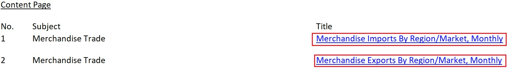{width=100%}
**Filter records** | Use Filter to filter out the records that are needed to be researched. | {width=100%}
**Unify Data Type and Measurement(1)** | Change all data types of records to “number” in Excel to prepare for data analysis | 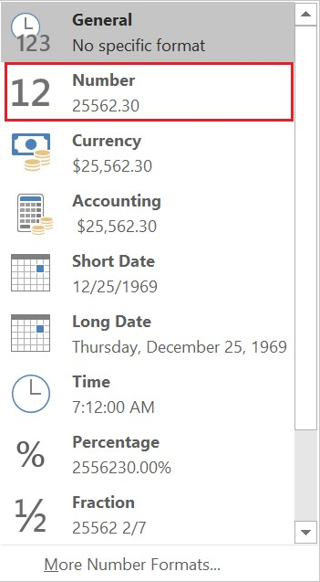{width=100%}
**Unify Data Type and Measurement(2)** | For data of Europe’s import and export in the data source, unify its measurement to “Thousand Dollars” | 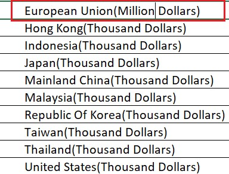{width=30%}
**Dealing with Import/Export Data File** | In the import and export data file, use “SUM’ function to calculate the sum of import and export from Jan,2020 to Dec,2020 separately and name their columns | 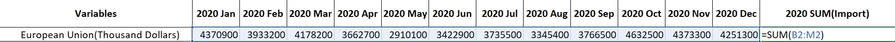{width=100%}
**Create a Summary sheet for all the aggregation data** | Copy the aggregation data from Import and Export data sheet and combine them in this new summary sheet for future preparation | 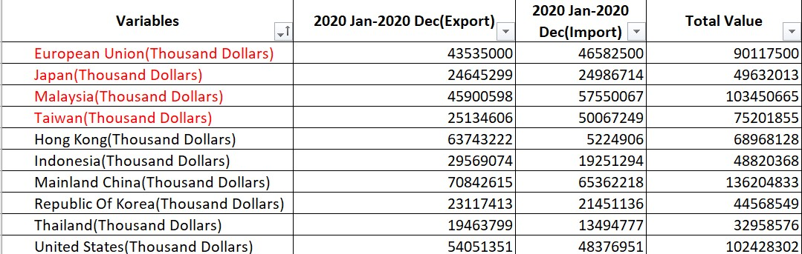{width=100%}
**Connect tables for future use** | Connect three modified tables based on the primary key "Variables" | {width=100%}
**Pivot Table Edition (Export/Import)** | Change sheet structure of Import Summary and Export Summary to pivot table by clicking from 2020 Jan to 2020 Dec for future net value area chart and line chart edition | {width=100%}
**Preparation for shape icon (national flags)** | To visualize different country variables, Download national flag images from [<font size="3"  color="blue">*Country Flags*</font>](https://countryflags.io/) to the Tableau file (Shapes/Flags) in the laptop.  | 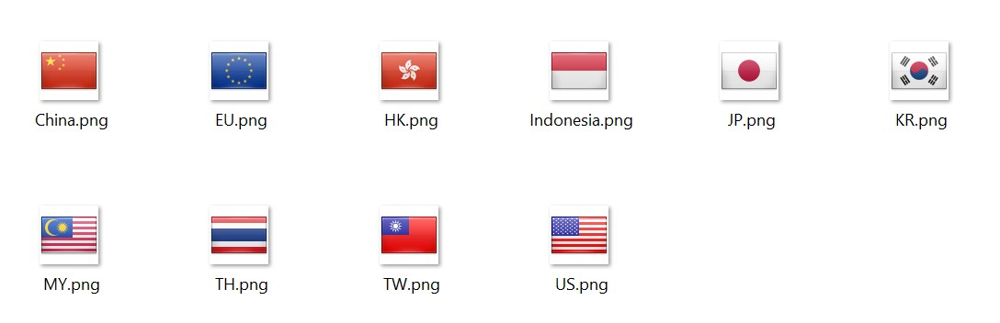{width=100%}

## 4.2	Data Visualization

### 4.2.1	Bubble-Pie chart

#### 1)	Basic Visualization Model (Bubble-Pie Chart)

Drag “2020 Import Value” and “2020 Export Value” separately to y-axis and x-axis. And cancel Aggregation option in Analysis tab.

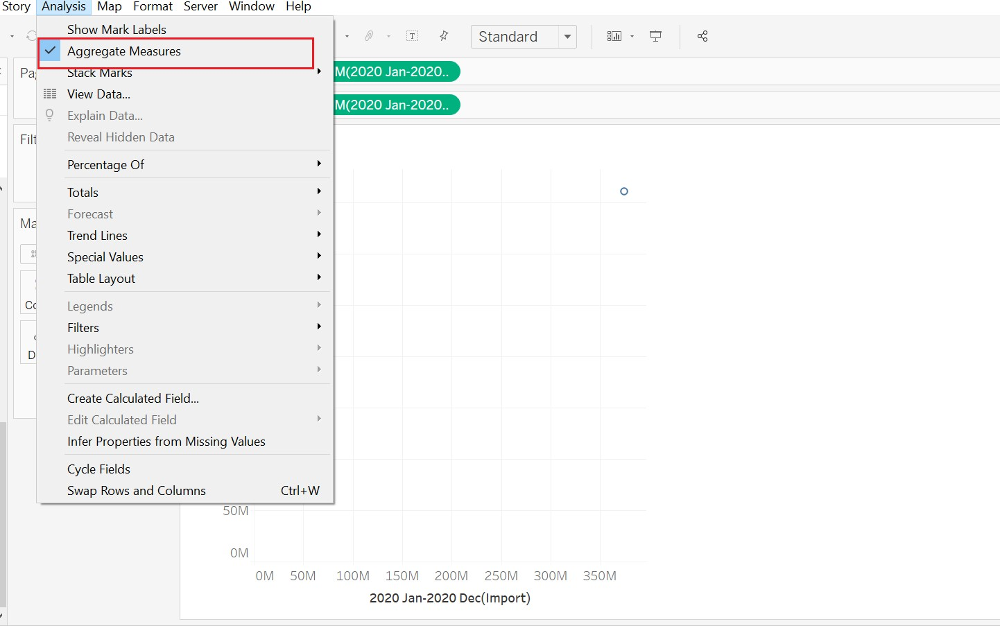{width=60%}

<font size="2" color="black">*Figure 3 Cancel Aggregation*</font>

Drag Measure Names to color icon and Measure Values to Size icon and adjust chart type to pie chart to have a pie chart. Then, drag “Variables” to detail icon to have a basic model of bubble-pie chart.

{width=20%}

<font size="2" color="black">*Figure 4 Adjustment*</font>

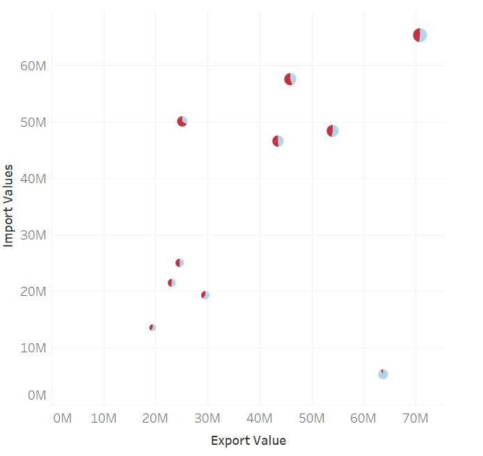{width=50%}

<font size="2" color="black">*Figure 5 Base Model*</font>

Change the size of bubbles by adjusting size icon.

{width=30%}

<font size="2" color="black">*Figure 6 Set Up Icons*</font>

Edit axis to make x-axis and y-axis standardized.

{width=30%}

<font size="2" color="black">*Figure 7 Axis Edition*</font>

To be more clearly to identify each pie chart, we need to add center point and adjust its border.
Drag import value to rows to duplicate two charts and cancel other icons in “Sum 2020 Import Value” control panel, only left detail icons of “Variables(Summary), And then adjust color to yellow and adjust circles’ border to black to make circles intuitive and well-marked.

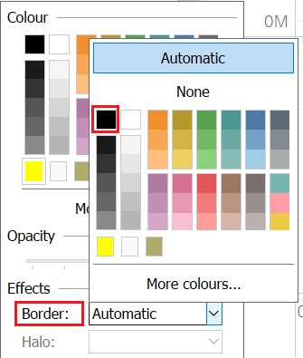{width=30%}

<font size="2" color="black">*Figure 8 Border Adjustment*</font>

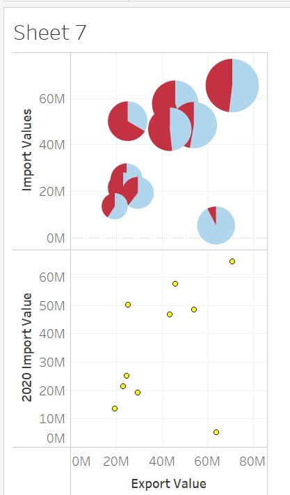{width=50%}

<font size="2" color="black">*Figure 8 Central Point*</font>

And then combine two charts together by using dual axis.

{width=50%}

<font size="2" color="black">*Figure 8 Axis Dulation*</font>

To make the central point in the center of every bubble, use synchronize axis to make two axis standard and cancel “Show Header” to keep only one y-axis.

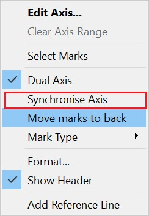{width=30%}

<font size="2" color="black">*Figure 9 Axis Dual*</font>


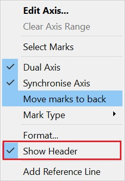{width=30%}

<font size="2" color="black">*Figure 10 Header Hidden*</font>

Finally, set up the main chart header. 

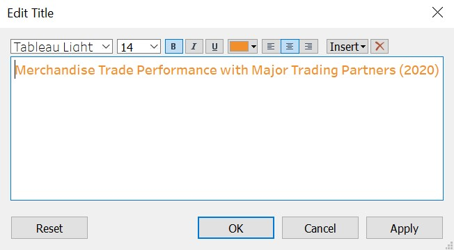{width=30%}

<font size="2" color="black">*Figure 11 Chart Title*</font>

#### 2)	Net Merchandise Trade Area Chart and Export-Import Line Chart (For Tooltip)
For Tooltip indication to provide more details of Singapore merchandise trade with these major partners, design a new area and line chart to provide the details and trace the trend of Export and Import change in 2020.
Drag Import Value and Export Value to Rows and Variables to Columns and set up Measure Values to Color icon.  Then, drag period to Column and set up its measure to months. And it will appear a basic line chart for export and import.

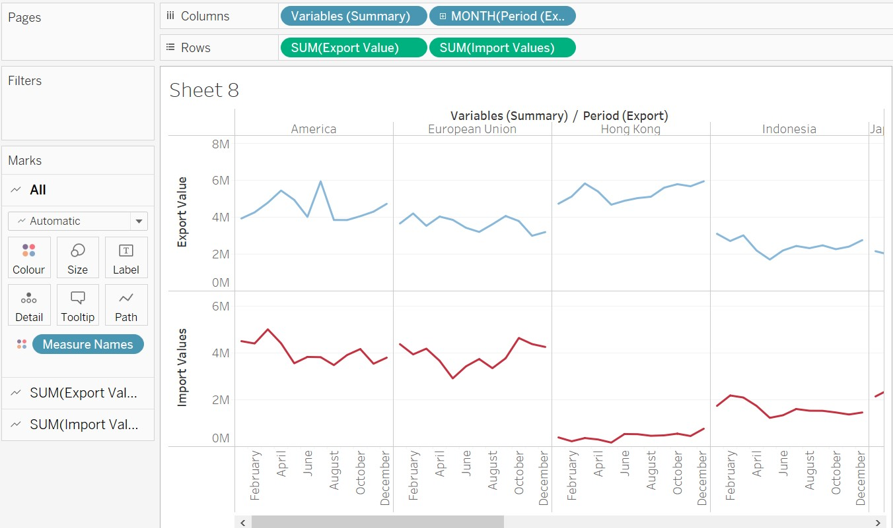{width=50%}

<font size="2" color="black">*Figure 12 Line chart*</font>

Use Dual Axis for Sum (Import Value) to combine two charts, synchronize the axis and cancel “Show the Header”.

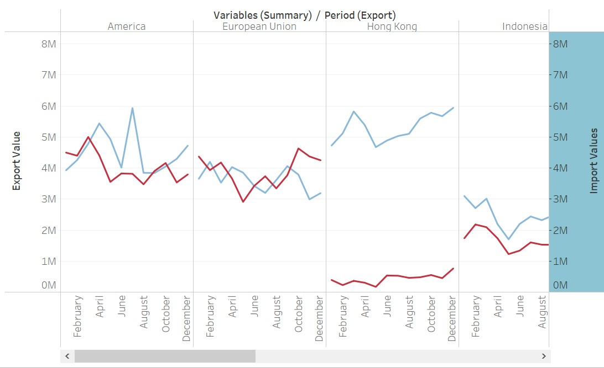{width=50%}

<font size="2" color="black">*Figure 13 Dual Axis*</font>

Use Calculation field to generate a new variable “Net Value1” for area chart use. Then drag it to rows and change the new chart type to area chart.

{width=30%}

<font size="2" color="black">*Figure 14 Calculation Field*</font>

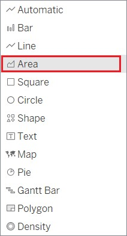{width=30%}

<font size="2" color="black">*Figure 15 Area Set up*</font>

{width=50%}

<font size="2" color="black">*Figure 16 Line-Area Chart*</font>


For clearly observing the net value is negative or not, we add a reference line to clarify the average of net value, and use the format to accurate the figure to the nearest tenth.

{width=30%}

<font size="2" color="black">*Figure 17 Reference Line*</font>

{width=30%}

<font size="2" color="black">*Figure 18 Format*</font>

Cancel the header show of x-axis .

{width=50%}

<font size="2" color="black">*Figure 19 Header Set up*</font>

#### 3)	National Flag Table (For Tooltip)
Drag Variables to Rows and set the calculation field for exporter and importer roles identification.

{width=30%}

<font size="2" color="black">*Figure 20 Calculation Field*</font>

After finishing the calculation field, drag Role to Rows to generate a new national flag table for future use.

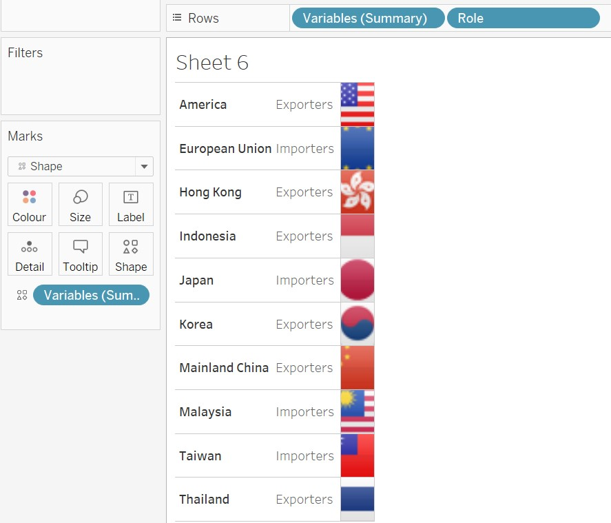{width=50%}

<font size="2" color="black">*Figure 21 Flag Chart*</font>

#### 4)	Add national flag chart, line chart and graph chart to tooltip of main chart

Insert the modified two sheets to tooltip of main chart and set up the font size to 10 and change color of Export and Import Value. Then set up a new value “Total Value” .

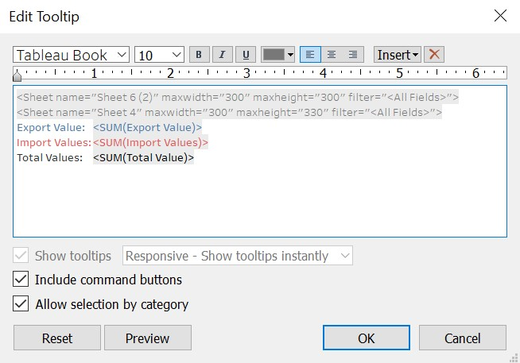{width=30%}

<font size="2" color="black">*Figure 22 Tooltip*</font>


# 5.	Final Visualization

Add Main chart to dashboard and set up the legend to flowing to configure its location. 

## 5.1	Dashboard

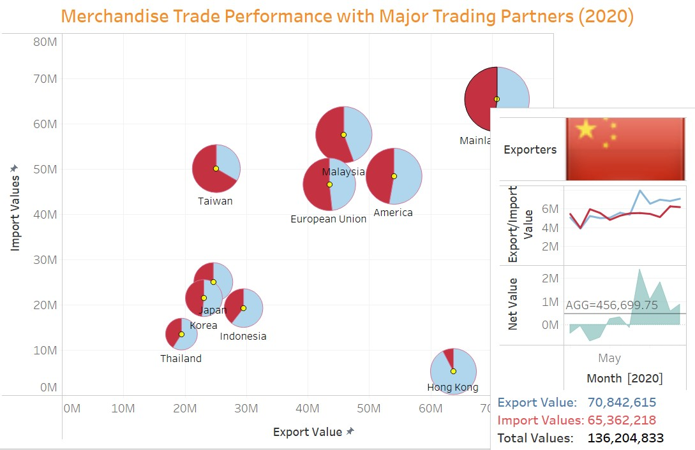{width=100%}

<font size="2" color="black">*Figure 23 Dashboard*</font>


## 5.2	Observation

**1)	Extreme Value**

The largest Major merchandise partner for Singapore among these countries is China, and the smallest merchandise partner is Thailand. For net merchandise trade value, country who gains the lowest merchandise trade net value is Taiwan, the highest is Hong Kong and the most balanced one is Japan, which means the value of Japan's imports and exports from Singapore is well balanced

**2)	Constant Value**

For Export performance, Singapore’s export always outweighs its import with Hong Kong and Indonesia in every month of 2020. However, Singapore’s import is always higher than export with Malaysia and Taiwan. Singapore's monthly rise and fall in Indonesia's imports and exports are extremely synchronized.

**3)	Trend Insight**

In terms of exports, Singapore's performance is not ideal. For most regions or countries , there is a downward trend in exports, except Hong Kong ,China and Taiwan these three partners, which shows increasing trend.
On the import side, it can be seen from the linear trend line that the proportion of partners that Singapore import increases and  that import  decreases is similar.


